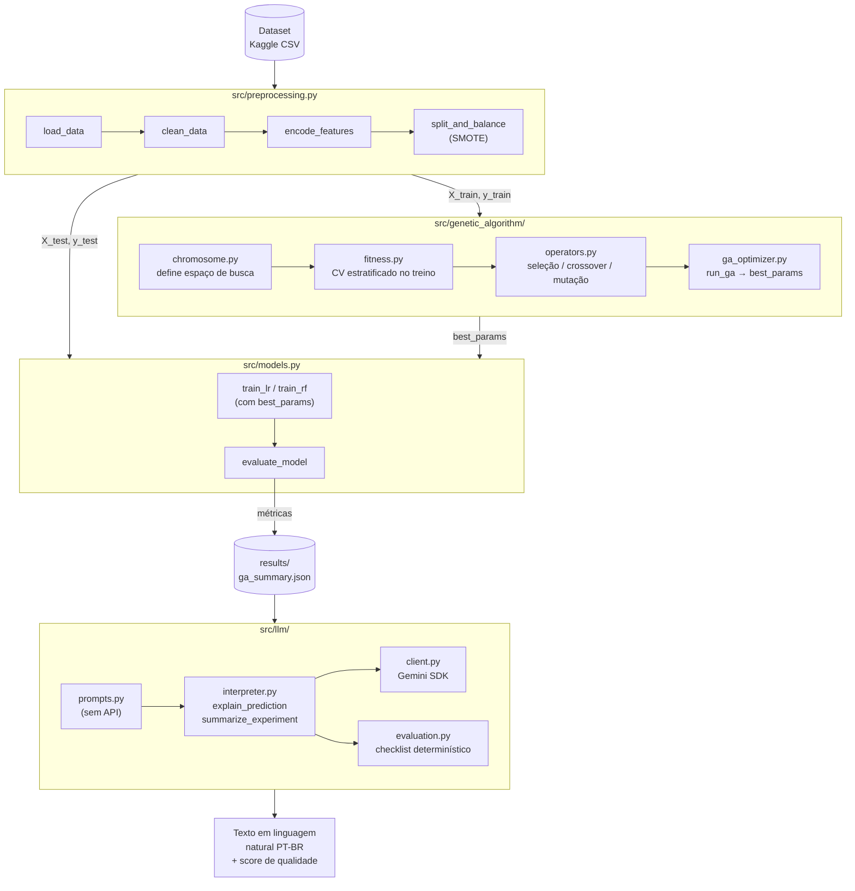
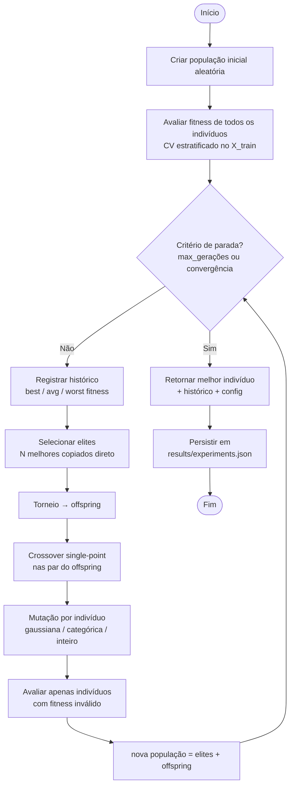
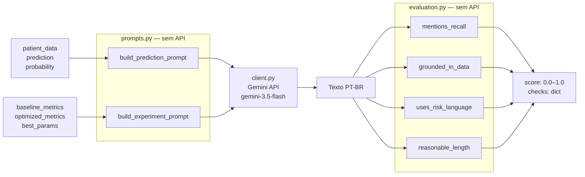

# Arquitetura do Sistema — Stroke Prediction Phase 2

**FIAP Pós-Tech IA para Devs — Tech Challenge Fase 2**

---

## Visão Geral

O sistema combina três camadas:

1. **Pipeline de ML** — pré-processamento e modelos baseline (herdado da Fase 1)
2. **Motor de Otimização Genética** — ajuste automático de hiperparâmetros via DEAP
3. **Camada de Interpretação LLM** — geração de explicações em linguagem natural via Google Gemini



---

## Fluxo do Algoritmo Genético



---

## Fluxo da Integração LLM



---

## Estrutura de Diretorios

```
stroke-prediction-phase2/
├── data/
│   └── download_data.py          # Download do dataset via kagglehub
├── src/
│   ├── preprocessing.py          # Pipeline completo de pre-processamento
│   ├── models.py                 # Treino, avaliacao, save/load, predict
│   ├── genetic_algorithm/
│   │   ├── chromosome.py         # Codificacao dos genes e decodificacao
│   │   ├── fitness.py            # Funcao fitness com CV estratificado
│   │   ├── operators.py          # Selecao, crossover, mutacao
│   │   └── ga_optimizer.py       # Loop principal do AG com elitismo
│   └── llm/
│       ├── client.py             # Wrapper do Gemini SDK
│       ├── prompts.py            # Montagem dos prompts (sem chamada de API)
│       ├── interpreter.py        # Orquestra prompts + cliente
│       └── evaluation.py         # Checklist deterministico de qualidade
├── notebooks/
│   ├── 01_baseline.ipynb         # Reproducao da Fase 1 (linha de base)
│   ├── 02_genetic_algorithm.ipynb # Experimentos AG + comparativo
│   └── 03_llm_integration.ipynb  # Demonstracao LLM com avaliacao
├── tests/                        # 54 testes unitarios (pytest)
├── results/
│   ├── experiments.json          # Historico de fitness por geracao
│   └── ga_summary.json           # Metricas baseline vs. otimizado
├── .env.example                  # Template para GOOGLE_API_KEY
└── requirements.txt
```

---

## Modulo 1 — Preprocessamento (`src/preprocessing.py`)

| Funcao | Responsabilidade |
|--------|-----------------|
| `load_data()` | Carrega o CSV; falha com mensagem clara se ausente |
| `clean_data()` | Remove coluna `id`, filtra genero `Other` (3 registros) |
| `encode_features()` | One-Hot Encoding com `drop_first=True` |
| `split_and_balance()` | Split estratificado 80/20 + SMOTE apenas no treino |
| `prepare_pipeline()` | Composicao das quatro funcoes acima |

**Decisao:** o `bmi` nulo e preenchido com a media do conjunto de treino *antes* do SMOTE, evitando vazamento de dados para o teste.

---

## Modulo 2 — Algoritmo Genetico (`src/genetic_algorithm/`)

### Representacao dos Cromossomos (`chromosome.py`)

**Logistic Regression — 4 genes:**

| Gene | Tipo | Espaco de busca |
|------|------|-----------------|
| `C` | float | [0.001, 100.0] |
| `solver_idx` | int | 0–3 → {lbfgs, liblinear, saga, newton-cg} |
| `max_iter` | int | [100, 1000] |
| `cw_idx` | int | 0–1 → {None, "balanced"} |

**Random Forest — 5 genes:**

| Gene | Tipo | Espaco de busca |
|------|------|-----------------|
| `n_estimators` | int | [50, 500] |
| `max_depth_idx` | int | 0 → None; 1–28 → profundidade 3–30 |
| `min_samples_split` | int | [2, 20] |
| `min_samples_leaf` | int | [1, 10] |
| `cw_idx` | int | 0–1 → {None, "balanced"} |

**Decisao:** genes em espaco natural (nao normalizado) para facilitar debug e leitura dos resultados.

### Funcao Fitness (`fitness.py`)

```
fitness = 0.6 * recall_cv + 0.4 * f1_cv
         - 0.15  (penalidade se recall_cv < 0.30)
```

- Avaliada com CV estratificado de 2–5 folds *somente sobre X_train*
- Retorna tupla `(float,)` compativel com DEAP `FitnessMax`

**Decisao:** peso maior para recall por ser metrica clinica principal (minimizar falsos negativos de AVC).

### Operadores (`operators.py`)

| Operador | Implementacao |
|----------|--------------|
| Selecao | Torneio (`tournsize=3`) via `deap.tools.selTournament` |
| Crossover | Single-point (`deap.tools.cxOnePoint`), taxa padrao 0.80 |
| Mutacao float | Gaussiana com sigma proporcional ao intervalo do gene, clamp nos limites |
| Mutacao int categorico | Troca aleatoria entre categorias validas |
| Mutacao int numerico | Passo gaussiano arredondado, clamp nos limites |

---

## Modulo 3 — Integracao LLM (`src/llm/`)

### Estrategia de Prompt Engineering

Dois templates em `prompts.py`:

1. **`build_prediction_prompt`** — diagnostico individual
   - Injeta todos os features do paciente como lista de bullets
   - Instrui o modelo a usar apenas dados fornecidos (sem inventar exames)
   - Pede linguagem de risco, nao diagnostico categorico
   - Exige resposta em PT-BR, objetiva, sem jargao tecnico

2. **`build_experiment_prompt`** — resumo do experimento AG
   - Injeta metricas baseline e otimizado, hiperparametros e deltas calculados
   - Contextualiza o recall como metrica principal (falsos negativos)
   - Pede resumo executivo para gestores de saude

### Checklist de Qualidade (`evaluation.py`)

| Regra | Verificacao |
|-------|-------------|
| `mentions_recall` | Se `source_data` tem chave `recall`, o texto deve mencionar "recall" |
| `grounded_in_data` | Texto cita ao menos um valor numerico presente nos dados de entrada |
| `uses_risk_language` | Texto usa palavras de probabilidade/risco (nao afirmacao categorica) |
| `reasonable_length` | 40 ≤ len(texto) ≤ 4000 |

**Score final:** media aritmetica das 4 regras → float em [0, 1].

**Decisao:** checklist deterministico (nao LLM-as-judge) para ser 100% reprodutivel e executavel em CI sem custo de API.

---

## Decisoes Tecnicas

| Decisao | Alternativa considerada | Justificativa |
|---------|------------------------|---------------|
| DEAP como framework GA | Implementacao manual | DEAP tem tipos `Individual`/`Fitness` nativos, operadores prontos e e amplamente usado em pesquisa |
| Gemini 3.5 Flash | GPT-3.5, Llama local | Gratuito para o volume do projeto, SDK oficial Python, sem necessidade de infra local |
| CV de 2 folds na fitness | CV de 5 folds | Velocidade de execucao; 5 folds aumenta o tempo ~2.5x sem ganho expressivo dado o SMOTE |
| Checklist deterministico | LLM-as-judge | Sem custo de API, 100% reprodutivel, roda em CI; limitacao: nao captura qualidade semantica fina |
| Fitness = 0.6*recall + 0.4*f1 | Apenas recall | Recall puro incentiva trivialmente prever todos como positivo; o peso de F1 penaliza isso |
| Genes em espaco natural | Genes normalizados [0,1] | Mais legivel nos resultados, mais facil de debugar |
| Elitismo com N fixo | Sem elitismo | Garante monotonia do melhor fitness entre geracoes |

---

## Limitacoes Conhecidas

- **CV rapido vs. estabilidade:** com `cv=2` e `patience` baixo, os experimentos convergem rapido mas podem ser sensiveis ao `random_state`. Para publicacao, recomenda-se `cv=5` e `patience>=8`.
- **Populacoes pequenas:** populacoes de 20–50 individuos sao adequadas para o espaco de busca (4–5 genes), mas podem perder diversidade em modelos com mais hiperparametros.
- **Qualidade do LLM:** o checklist nao garante que o texto seja clinicamente correto — serve como filtro de sanidade automatico. Revisao humana e necessaria antes de uso clinico real.
- **Dependencia de API externa:** o modulo LLM requer conexao com a API do Google. Sem `GOOGLE_API_KEY` valida, apenas os testes com mock funcionam.
- **Dataset desbalanceado:** mesmo com SMOTE, o desbalanceamento original (4.9% positivos) afeta o threshold de decisao. A funcao fitness com penalizacao de recall < 0.30 mitiga isso, mas nao elimina.
